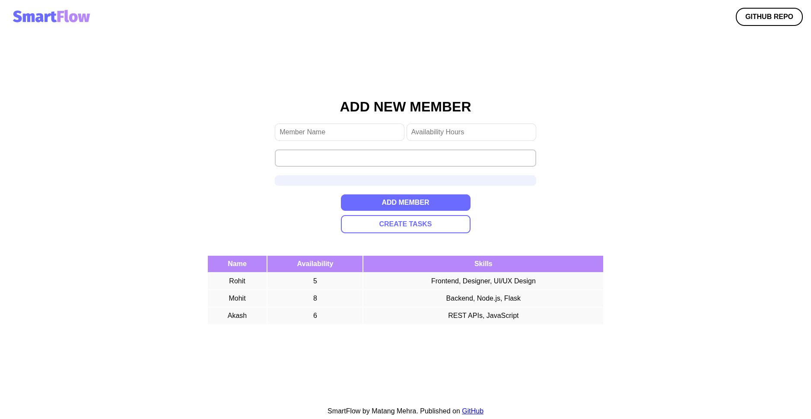
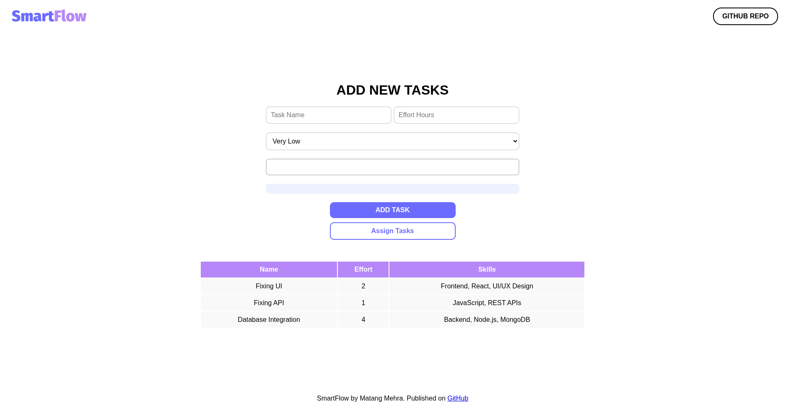
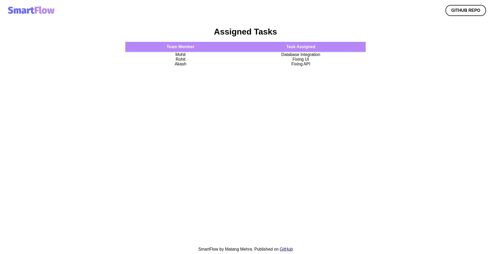

# 🚀 SmartFlow – Intelligent Task & Workflow Optimizer

SmartFlow is a lightweight, intelligent task assignment system designed to improve team productivity by automatically distributing tasks based on skills, availability, workload, and priority.

Built during the **Snowstorm Hackathon by Tech4Hack**, this project focuses on solving real-world team coordination problems using simple, explainable logic instead of complex black-box AI.

[Give it a try](https://smart-flow-gray.vercel.app/) and see how it can transform your team's workflow!

---

## 📌 Problem Statement

In most teams:
- Tasks are assigned manually  
- Workload becomes uneven  
- Skilled members get overloaded  
- There is no visibility into optimal task distribution  

This leads to:
- ❌ Inefficiency  
- ❌ Missed deadlines  
- ❌ Team burnout  

---

## 💡 Solution

SmartFlow introduces a **scoring-based task assignment system** that:

- Matches tasks with the most suitable team members  
- Balances workload across the team  
- Considers real-world constraints like skills and availability  
- Dynamically rebalances tasks when conditions change  

---

## 🧠 How It Works

SmartFlow uses a **weighted scoring algorithm** to evaluate each task-member pair:
```
Score = (Skill Match * 0.4) + (Availability * 0.3) + (Workload Balance * 0.2) + (Priority Match * 0.1)
```


### Factors Explained:
- **Skill Match** → Does the member have required skills?
- **Availability** → Does the member have time?
- **Workload Balance** → Is the member already overloaded?
- **Priority** → How urgent is the task?

---

## ⚙️ Features

- ✅ Smart task assignment  
- ✅ Priority-based scheduling  
- ✅ Workload balancing  
- ✅ Dynamic task rebalancing  
- ✅ Simple and clean UI  
- ✅ Fully explainable logic (no black-box AI)  

---

## 🔄 Rebalancing Logic

SmartFlow can adjust assignments when:
- A team member becomes overloaded  
- Availability changes  
- Tasks are delayed  

Strategy:
1. Identify overloaded member  
2. Select lowest-priority task  
3. Reassign to next best candidate  

---

## 🛠️ Tech Stack

### Backend
- Python
- Flask

### Frontend
- HTML
- CSS
- JavaScript (Vanilla)

### Core Logic
- Custom scoring algorithm (no external ML libraries)

---

## 📂 Project Structure
```

SmartFlow/
    ├── README.md
    ├── app.py
    ├── requirements.txt
    ├── smartflow_engine.py
    ├── static/
    │   ├── script.js
    │   └── style.css
    └── templates/
        ├── addTeamMember.html
        ├── assignedTask.html
        ├── createTasks.html
        ├── createTeam.html
        ├── index.html
        └── masterTemplate.html
```

---

## ▶️ Getting Started

### 1. Clone the repository
```bash
git clone https://github.com/mgmehra2005/SmartFlow.git
cd SmartFlow
```


### 2. Install dependencies
```bash
pip install -r requirements.txt
```


### 3. Run the application
```bash
python app.py
```


### 4. Open in browser
```
http://localhost:5000
```


---

## 🧪 Demo Flow

1. Add team members with skills and availability  
2. Add tasks with required skills and priority  
3. Click **Smart Assign**  
4. View optimized task distribution  
5. Trigger **Rebalance** to adjust assignments dynamically  

---

## 📸 Screenshots


*Adding team members with skills and availability*

*Creating new tasks with priority and skill requirements*

*Smart task assignment in action*


---

## 📜 Hackathon

This project was built as part of:

**Snowstorm Hackathon – Tech4Hack**

---

## 📈 Future Improvements

- Role-based team management  
- Real-time updates  
- Advanced analytics dashboard  
- Machine learning-based predictions  
- Integration with tools like Trello / Slack  

---

## 🤝 Contributing

This is a learning project, but contributions and suggestions are welcome!

---

## 📬 Contact

Feel free to connect or share feedback:

- LinkedIn: [My LinkedIn Profile](https://www.linkedin.com/in/matangmehra)  

---

## ⭐ Acknowledgement

Thanks to **Tech4Hack** for organizing the Snowstorm Hackathon and providing a platform to learn and build.

---

## 🏁 Final Note

SmartFlow is not just about assigning tasks —  
it’s about making teams **work smarter, not harder**.